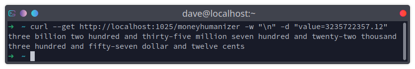

<a name="readme-top"></a>

<br />
<div align="center">
<h3 align="center">Simple English-word Money Value Humanization API</h3>

  <p align="center">
    This project was created as part of a recruitment test. Its sole purpose is to provide a simple interface through which a user may humanize dollars-and-cents decimal values into English words.
  </p>
</div>

<!-- TABLE OF CONTENTS -->
<details>
  <summary>Table of Contents</summary>
  <ol>
    <li>
      <a href="#about-the-project">About The Project</a>
      <ul>
        <li><a href="#built-with">Built With</a></li>
      </ul>
    </li>
    <li>
      <a href="#getting-started">Getting Started</a>
      <ul>
        <li><a href="#prerequisites">Prerequisites</a></li>
        <li><a href="#installation">Installation</a></li>
      </ul>
    </li>
    <li><a href="#usage">Usage</a></li>
    <li><a href="#testing">Testing Methodology</a></li>
    <li><a href="#potential-improvements">Potential Improvements</a></li>
    <li><a href="#contact">Contact</a></li>
  </ol>
</details>


<!-- ABOUT THE PROJECT -->
## About The Project



This project makes use of a recursive algorithm to convert a decimal number into a humanized English-language word output for dollars-and-cents values. It has been designed as a REST API powered by `ASP.NET 6`, using `Autofac` as an IOC container. `Swashbuckle` has also been implemented to provide easy access to a Swagger UI to assist with API testing and integrations.

### Algorithm Explanation
The algorithm code may be found in [MoneyHumanizer.cs](/MoneyHumanizer.Service/Humanizers/MoneyHumanizer.cs). An explanation of the assumptions and thought that went into its design may be found [here](/methodology.md).

**A general explanation of the algorithm code follows:**

1. Define "digit groups" corresponding to "hundred", "thousand", "million" etc. and
    associate them with the number of digits that any given number must have to belong
    to these groups.

2. Account for digits corresponding to numbers less than 100 as these numbers have unique
    names in English compared to every other number

3. Remove any left-padded zeros from the input digit array

4. Using the number of digits minimally required for the digit grouping to which the 
    number belongs, take away this many digits from the end of the number and humanize
    what remains using a recursive function call.

    This is done to accomplish the humanization of, for example, the "one hundred" in
    "one hundred thousand".

    Following this, append the actual digit grouping for the number. 
    e.g. "thousand" in "one hundred thousand".

5. Discarding the digits that were just humanized, recursively call the function to 
    humanize any remaining digits in the input.

6. Use a builder to append all of the recursive function returns together and return 
    the result.

7. Perform steps 1-6 separately for dollars and cents in the input, appending pluralized
    words "dollar"/"dollars" or "cent"/"cents" respectively.


<p align="right">(<a href="#readme-top">back to top</a>)</p>


<!-- GETTING STARTED -->
## Getting Started

The project may be built and run using either the .NET 6 SDK or using Docker.

### Prerequisites

* .NET 6.0 SDK
  ```sh
  # UBUNTU
  sudo apt install dotnet-sdk-6.0
  ```
* OR: Docker

### Installation

1. Clone the repo
   ```sh
   git clone https://github.com/davidvogel94/TEST-dollars-and-cents-english-humanizer.git
   ```
2. Build and run the service with the included Dockerfile 
   ```sh
   docker build -t moneyhumanizer:1.0 -f Dockerfile .
   docker run -d -p "1025:1025" --name moneyhumanizer moneyhumanizer:1.0
   ```
3. **OR:** run the `MoneyHumanizer.Service` project directly from your IDE or via the CLI using:
   ```sh
   dotnet run --project MoneyHumanizer.Service
   ```

<p align="right">(<a href="#readme-top">back to top</a>)</p>


<!-- USAGE EXAMPLES -->
## Usage

To see humanized output, send a GET request to: `http://localhost:1025/moneyhumanizer?value=3`
```sh
curl --get http://localhost:1025/moneyhumanizer -w "\n" -d "value=3235722357.12"
```
*Output:*
> three billion two hundred and thirty-five million seven hundred and twenty-two thousand three hundred and fifty-seven dollar and twelve cents

### Swagger UI

As this app uses Swashbuckle, a Swagger UI for the API is accessible at:
```
http://localhost:1025/swagger/index.html
```
The Swagger UI may also be used to test the output of the humanizer code.

## Testing
Notes on test plans/methodology may be found [here](/testplan.md).

<p align="right">(<a href="#readme-top">back to top</a>)</p>

## Potential Improvements

### Humanizer libraries
Firstly, it is noted that humanizer libraries exist that do exactly what this code has been designed to do. It makes more sense to implement one of these libraries outside the context of a code challenge, as they have already reached maturity for use-cases such as this and as such, code maintenance, bugs, readability etc. are far less of a concern.

### Output Validation Rules
It's probably a good idea to implement some validation rules based on the humanization syntax being output. This could lead to more unit-testability of the output of the humanizer based on how it responds to validation passing or failing.

### Structured Output with Metadata
The output can be serialized into a more API-consumer-friendly JSON format.

### Input validation / limitation
It's technically possible to provide the API with enough input to induce a stack overflow due to the algorithm's use of recursion. The input should ideally be validated or limited in some way if this is at all a likelihood in order to avoid an easy denial-of-service attack vector via crashing the application container.

<!-- CONTACT -->
## Contact

David Vogel - [LinkedIn](https://linkedin.com/in/david-vogel-au) - david.vogel@outlook.com.au

<p align="right">(<a href="#readme-top">back to top</a>)</p>

